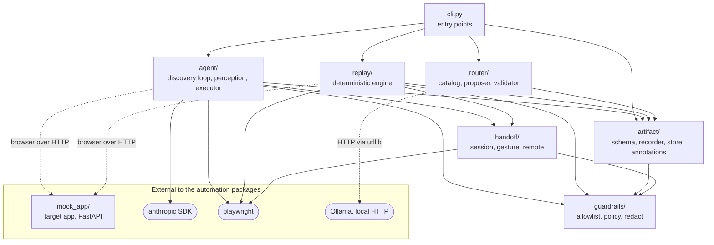

# REPORT

A goal goes in. An LLM drives a real browser to complete it once. The run is saved as a typed, versioned artifact. Replay then executes that artifact with no model and returns success, a business outcome, or a debuggable failure. A human can take over the live session.

The target is a legacy-style mock credit-union console (`mock_app/`: table layout, no test IDs, an iframe balance panel, a 403 lock page, a session interstitial, injectable 503s). Five capabilities were discovered against it and saved in `artifacts/`: `fetch-account-balance`, `transfer-funds`, `open-member-subaccount`, `create-auto-loan-for`, `update-member-address`. All five are `draft`. `pytest` collects 50 tests, all of which passed in 118 s on the last run; one needs a local Ollama model and skips itself without one.

Where each Section 3 requirement lives:

| Requirement | Module |
|---|---|
| 3.1 Goal-driven loop, stopping conditions | `agent/loop.py` (30 steps, 300 s, `give_up`), `agent/perception.py`, `agent/executor.py`, `agent/llm.py` |
| 3.2 Typed, versioned artifact | `artifact/schema.py`, `artifact/recorder.py`, `artifact/store.py` |
| 3.3 Deterministic replay, three-way result | `replay/executor.py`, `replay/locators.py`, `replay/outcomes.py` |
| 3.4 Allowlist, risk, redaction | `guardrails/allowlist.py` + `config/allowlist.json`, `policy.py`, `redact.py` |
| 3.5 Evidence | `evidence/` (written by `agent/loop.py`, `replay/executor.py`, and `handoff/session.py`), plus redacted run logs in `logs/` (`logging_config.py`) |
| 3.6 Human handoff | `handoff/session.py`, `handoff/gesture.py`, `handoff/remote.py` |
| 3.7 Heterogeneity and tenants | design only, §4 |

## 1. Architecture

One Python process. This is the real import graph, produced by walking every `import` statement in the repo (tests excluded), plus the runtime couplings that are not imports. `logging_config.py` (used by `cli.py` and `mock_app/`, importing only `guardrails.redact`) is left out for legibility. Solid arrows are imports and dotted arrows are runtime calls over a socket. There is no import from `artifact/` back to `agent/`.

**What the graph shows:**
- **No cycle back to `agent/`.** `artifact/recorder.py` references `agent.loop` only for a type, guarded under `TYPE_CHECKING`, so importing `artifact/` never pulls in `agent/`, the `anthropic` SDK, or Playwright. `tests/test_architecture.py` imports the artifact modules in a fresh interpreter and fails if any of those three load, guarding this boundary against regression.
- **Checked at runtime:** `replay.executor` loads no `agent` and no `anthropic`; `router.router` loads no `agent`, no `anthropic`, and no Playwright; `guardrails/` imports nothing else from the repo.
- **`replay/` imports `handoff/gesture.py`,** which holds the human-capture code, to draw the approval banner. Capture is never armed on that path (`capture=False`), so that is enforced by a flag, not by the import graph.
- **`mock_app/` imports nothing from the automation code;** discovery and replay reach it only as a web server through a browser.

- **One process, not services.** Discovery is occasional and human-triggered, and replay drives one browser tab. The boundary that matters is structural: `replay/` must not import the model client or the discovery loop, and `router/` must not import a browser, the discovery agent, or a model SDK. `tests/test_architecture.py` checks that in the source.
- **Perception is a text snapshot, never a screenshot.** `agent/perception.py` walks the DOM and every iframe and returns roles, accessible names, and short text in reading order, so a label always precedes its field. Claude (default `claude-sonnet-5`, one tool call per turn) sees only that list, so every action it takes already carries a locator.
- **The discovery loop proves what it claims.** `done` is refused unless every output matches a real `read_text`, every goal value applied is declared as an input and matches what the run typed (`agent/loop.py::_check_declared_inputs`, so a demo value is never baked in), and the success phrase is visible now and free of input values, output values, and long generated-looking numbers.
- **Router (stretch: agent-facing capability interface).** `cli.py capabilities` and `invoke` expose the artifacts as a catalog, run by name with typed args and no model. `task` adds plain English: a local Llama (`llama3.1:8b` via Ollama) only proposes, and `router/validator.py` decides (a real capability, the only one needed, exactly its inputs, values grounded in the goal, dropdown values mapped onto recorded choices). The model is asked twice with the catalog reversed and must agree; anything doubtful, including Ollama not running, becomes a discovery. The repo has no router accuracy benchmark, so none is claimed.

Trade-off accepted: the recorder keeps only the successful path, so heavy backtracking in a run would need a smarter pruning pass.

## 2. Artifact schema

`artifact/schema.py`, saved as `artifacts/<capability_id>@<semver>.json`, human-readable and diffable.

- **Contract.** `capability_id`, `version`, `status` (draft or approved), `description`, `goal_template` (the goal with `{placeholders}`), typed `inputs`, typed `outputs`, ordered `steps`, `final_checkpoint`, `overall_risk`. An input has a type, a description, a safe example, and `allowed_values` when it fills a dropdown. An output names the step that produced it (`source_step`). A calling agent sees a function signature.
- **No demo values in the file.** Step values are templates (`"{member_id}"`), bound by `(value, control)`, so two dropdowns both set to "Checking" stay two inputs. Sensitive-looking examples are redacted.
- **Targets are ranked lists.** Each target carries candidates in order: `role_name`, `text`, `css_path`, `coordinates`. `role_name` and `text` are emitted only when the name is one the browser's own accessible-name computation would produce. A neighbouring label is excluded as a candidate, since matching on it risks resolving to the label cell rather than the input it labels. A field's current value is never part of its name. A sensitive-looking candidate is dropped, not faked. `frame_chain` lists the iframe selectors to descend through (one level is exercised).
- **Declared error handling is data, and a reviewer adds it.** Discovery only sees the happy path. The artifact carries `business_outcomes`, `recoverable_conditions`, and an optional `commit_verification`. `artifact/annotations.py` stands in for the reviewer: outcomes about the application (unknown member, account lock, insufficient funds) are declared once per `app_id` and apply to every capability; workflow-specific ones (minimum deposit, missing recipient) live on the capability.
- **Checkpoints** are text, not URLs. The recorder stores the agent's success phrase as `text_contains`, checked across every frame. A URL path is only the fallback when no usable phrase was given.
- **Timing and tenancy:** optional `step_timeout_ms` and `checkpoint_timeout_ms`. `TargetApp.app_id` (the vendor product) is separate from `tenant_id` and `base_url` (the deployment).

## 3. Determinism & error handling

`replay/executor.py` never calls a model and never edits its artifact. Given typed params (missing or unknown params raise `ValueError` before anything runs), each step does this, in order:

1. **Recoverable condition.** A declared page state gets its declared recovery (one action, or a short sequence), then the same step continues. Never a loop. Two are declared: the session-renewal interstitial (click Continue) and, for the whole app, an expired session (sign back in, below).
2. **Business outcome.** A declared signature ends the run as `kind="business_outcome"`. This is a result, not a crash. The result names the outcome and says whether the capability or the app declared it.
3. **The step.** Resolve the target, act, verify. Replay waits for state: a target is re-resolved until it appears or the step timeout runs out, and each click is followed by a capped wait for the network to go quiet. A Playwright timeout gets one bounded retry. A step whose every locator still fails is reported immediately and is never retried or patched live, because that is the signal to re-discover.

After the last step, replay polls for whichever comes first: a declared business outcome, the final checkpoint, or the checkpoint timeout. A late "insufficient funds" is therefore reported as such, not as a timeout.

**Result contract.** `ReplayResult.kind` is `success` (with outputs), `business_outcome`, or `hard_failure`. A failure carries step index, action, expected, observed, the candidates tried, and `observed_page` (last document HTTP status, URL, start of the visible text, redacted), so an app error page reads differently from a drifted UI without opening the screenshot.

**Determinism.** The same steps run in the same order with no model, locators resolve in ranked order, and waiting is bounded polling, not fixed sleeps. The strategy that resolved each step goes into `strategy_log`, the raw drift signal (nothing aggregates it across runs yet).

**Ambiguous commits.** If a failure happens at or after a risky step and the artifact declares `commit_verification`, replay asks the app whether that attempt's write registered. Every request carries `X-Run-Id: <run_id>-a<N>`, the mock app stores it in a Source column beside what it wrote, and the check is "does this attempt's ID appear in the history?"
- **Found:** success, flagged `recovered_via_commit_verification` (outputs from later steps are missing, not invented).
- **Not found, twice, with a settle wait:** the whole transaction is re-run once. If that succeeds, a guard confirms the first attempt's ID is absent, else `hard_failure` and a human is asked. If it also fails, a human is asked once.
- **Check could not complete:** never retried, because unknown is not "not committed."

This needs an app that records a caller-supplied ID.

**Session expiry.** The mock app has a real sign-in page: a browser with no session, or an expired one, is bounced to it. Replay declares the expired-session page once per `app_id`, the same way as the app-level business outcomes in §2, so every capability recovers from it without being re-recorded. Credentials are read from `CONSOLE_USERNAME` and `CONSOLE_PASSWORD` in replay's own environment through `{env:NAME}` placeholders; none is ever written into an artifact, a log, or evidence (checked by a test). An expiry caught before any risky step triggers a sign-in and a full re-run of the recorded steps from the start, since a half-filled form is gone by then. An expiry at or after a risky step signs in before the commit check itself runs, because the history page sits behind the same login, then the existing commit rules apply as before (found, not found once, unknown). With no credentials available, or a second expiry during recovery, replay reports a `hard_failure` or escalates to a person. `ReplayResult.session_reauths` counts how many times a run signed back in. A visible run of the hardest case, `scripts/demo_session_expiry.py 3` (expiry discovered only after the write had gone through), signed back in once, recovered through the commit check, and added exactly one transfer.

**Limits.** Discovery meeting an expired session isn't handled, only replay. Multi-factor sign-in isn't modeled. The mock app grants a fresh browser a session, as if under single sign-on; an app that requires login at the very first screen isn't modeled. An expiry on a run's last, risky click ends as a failed final checkpoint rather than being caught by the commit check.

Tests: `tests/test_replay_system_errors.py` (timeouts, drift, interstitial, the three write capabilities, retry-once, duplicates, inconclusive checks, slow responses, late content), `tests/test_replay_capabilities.py` (business outcomes), and `test_an_expired_session_is_signed_back_in_and_money_never_moves_twice` (four cases — expiry before the confirm click, on it before the write, after the write, and with no credentials available — confirming exactly one transfer lands in every recoverable case and none in the failure case).

## 4. Heterogeneity & multi-tenant

**Surfaces.** The seam is two modules: `agent/perception.py` builds a `Target` from the current surface and `replay/locators.py` resolves one. The schema, recorder, and replay control flow do not know they are looking at a browser. A desktop app needs a second implementation of those two: `role_name` maps to UIA or AX, `css_path` to a control's index path in its window, `coordinates` stays, `frame_chain` becomes window descent. Two things are browser-shaped today: the allowlist is URL-based, and the stuck nudge keys on what a screen shows, not only its URL (§5), so it is closest to a web page's text. The mock app covers the legacy-web case; no desktop surface exists.

**Tenants.** Shared knowledge is keyed by `app_id`, so app-level business outcomes apply to every capability recorded against that app, and the catalog offers only capabilities for the requested host and port. Not built: per-tenant override records (same `capability_id` keyed by `(app_id, tenant_id)`, patching only the targets that differ), route canonicalization, and aggregating `strategy_log` into a drift alert.

## 5. Escalation & handoff

`handoff/session.py::HandoffSession` holds a state, `LLM_CONTROL` or `HUMAN_CONTROL`, and `agent/executor.py` refuses to issue an action unless the agent is allowed. Discovery runs headed by default, so the human uses the same window Playwright was driving (a headless run is reached through the DevTools link below). A new session is never created.

**How stuck is detected, and who can call a human:**
- The model calls `give_up` (the request carries the goal, step, URL, its reason, the page text it reasoned over, and a screenshot), or a watcher adds a "call give_up" warning to a result from the third arrival at the same screen, or the third identical action on an unchanged screen. A screen is its URL plus its visible text, so this works when every screen shares one URL, and filling a form's fields does not trip it (a screen whose text changes every time never matches, so it never warns).
- A human clicks or types in the window (a Playwright click looks identical, so the listener reports only input that arrives while the executor has not marked itself active), or touches `evidence/<run_id>/PAUSE_REQUESTED`.
- Max steps and the timeout end a run without escalating. Replay escalates on a hard failure (with `--escalate-on-failure`), an unresolved commit, or a suspected duplicate.

**Control and handback.** A banner on the live page carries the details and the buttons Resume, Restart, and End Run; a terminal prompt works as a fallback. Restart wipes the log and starts over in the same session, and the wall-clock deadline is never reset. Approve and Deny on a risky step is a yes/no gate and does not hand over control.

**Who can reach the page (`handoff/remote.py`).**
- **A person at the machine uses the visible window.** For a headless run, or anyone without physical access to the display, a run that can ask a person for something launches Chromium with a remote-debugging port (a free port per run, loopback only: no `--remote-debugging-address` is ever passed, and a test checks that the machine's own network address refuses a connection). Every escalation prints, beside the "look at the Chromium window" message, a link that opens DevTools on that run's own tab ID. For a headless run it is the only way in: DevTools shows the live DOM and a rendered page view that takes mouse and keyboard input.
- **Capture works the same way regardless of surface.** The gesture controller runs on headless runs as well, so the banner appears on the page and, in a discovery takeover, what a person does through the link is recorded like a click in a headed window (a replay takeover records nothing, by design). A test sends input the way DevTools does (events over the debugging port) and checks that the typing and click are captured as steps.
- **Demonstrated end to end:** a headless replay escalation where clicking Resume in the page view resumed the run, and a full `scripts/demo_human_takeover.py --headless` run where a click made through the link became step 5 of 13 in the recorded artifact, which then replayed on its own.
- **Not solved:** a person on another machine needs an SSH tunnel to the port that they set up (the terminal prints the command; nothing opens one). The port has no authentication: anything on the machine that can reach it controls the browser while the run is alive (`REMOTE_DEBUGGING=off` closes it). Only Chromium-family browsers open the DevTools page. A draft artifact with a risky step replayed headless with no operator is still refused before any step runs. Typing into the page view by hand was not separately tried, and there is no recorded evidence run of a remote takeover.

**Learning versus operating.** In discovery, the human's clicks and fills are captured with the agent's own locator-building code and become steps (`source="human_intervention"`) in position, including across page navigations. In replay, a human is operational recovery only: one retry of the same recorded step, capture is never armed, and `HandoffSession.escalate` drops captured actions for any reason outside `stuck`, `human_gesture`, and `human_requested`.

**Evidence and limit.** Three recorded runs. `evidence/discovery_20260930T163455Z` is a real visible run with four takeovers, each ended with Restart, after which the run completed. `evidence/discovery_20261001T000022Z` is stuck detection and escalation with the real agent on a dead end (a locked member): the screen watcher warned at step 12, the agent called `give_up` at step 13, and a person ended the run (the answer was piped in on stdin, not typed live). `evidence/replay_20260930T235359Z_*` is a replay escalation run by a person in a visible window: it is staged (the capability's declared recovery for the session-renewal page was removed in memory), and it shows `captured_actions: []`. The resume-with-captured-steps path and the remote-link path are covered by `tests/test_handoff.py`, not by a recorded run. The operator console is a banner plus a DevTools link, deliberately not a co-browsing console.

## 6. Safety

- **Allowlist** (`config/allowlist.json`): hosts, path prefixes, and action types, loaded by both phases. Replay and discovery refuse an explicit `navigate` to a URL outside it and any action type not listed. Limits: a click on a link is not URL-checked (there is no request interception), and the path prefixes include `/`, so the host list is the effective boundary.
- **Risk** (`guardrails/policy.py`): a click whose target name matches `confirm`, `delete`, `close account`, or `withdraw funds` is `confirm`; an off-allowlist navigate is `blocked`; everything else is `safe`.
- **Risky steps are handled conservatively, by confirmation.** A draft artifact asks a human before each `confirm` step and fails closed with no approver (a headless replay with no operator is refused before any step runs). An `approved` artifact runs them unattended and lists them in `unattended_risky_steps`. `cli.py approve` is a deliberate human step with no signer or expiry. `cli.py task` also confirms the router's interpreted arguments before an approved risky capability runs.
- **Redaction** (`guardrails/redact.py`): by field name (password, SSN, card number, token) and by shape (SSN, card, JWT, phone, email, street address), applied to every log line, discovery and replay evidence, the handoff log (a human's typed value is also redacted by field name), and artifact examples. Raw applied values exist only in memory. Tests: `tests/test_redaction.py`, `tests/test_guardrails.py`. The demo addresses are fictional.

**Limits, stated plainly.**
- The risk classifier looks at button names only. `update-member-address` writes data through a "Save" button that is not flagged, so its `overall_risk` is `safe` and it runs ungated even as a draft.
- An irreversible button named "Proceed" would be missed.
- Redaction does not recognize personal names, balances, or PO-box addresses, and screenshots are not redacted.
- Approval is a single flag.
- While a run can ask a person for something, its debugging port is open on loopback with no authentication (§5).

## 7. Cuts

**Not fully satisfied, from the brief:**
- **3.4:** path-level allowlisting and write-risk classification are weak (§6).
- **3.6:** a person who is not at the machine needs an SSH tunnel they set up themselves, and the debugging port has no authentication (§5). The recorded discovery takeover ended in restarts, so the teach path and the remote link are test-covered only; the one recorded replay escalation is staged.
- **3.7:** designed, not built (§4).

**Cut on purpose:** a graphical operator console and any desktop surface; per-tenant overrides, route canonicalization, and cross-run drift aggregation; confidence scoring and multi-run stability; LLM-assisted fallback on replay (replay never turns into discovery); a router benchmark.

**Other known limits:** a text checkpoint cannot tell a success page from an error page containing the same words; dropdown typos are read only when close to exactly one recorded choice (flagged); commit verification needs the app to store a caller-supplied ID; the mock app's state is in memory; and session-expiry recovery (§3) is replay-only, has no multi-factor or first-screen-login support, and doesn't route a last-click expiry through the commit check.

**Next, in order:**
1. Intercept requests so the allowlist covers link clicks and redirects.
2. Classify write buttons by the form's effect, or let a reviewer mark risky steps at approval.
3. Record a teach-path discovery run (a person's actions becoming steps) as evidence, and a replay escalation that was not staged.
4. An authenticated remote operator surface (a token-protected proxy in front of the loopback port, or a streamed view) so no hand-made tunnel is needed.
5. Per-tenant override records, then a stability score from repeated replays.
